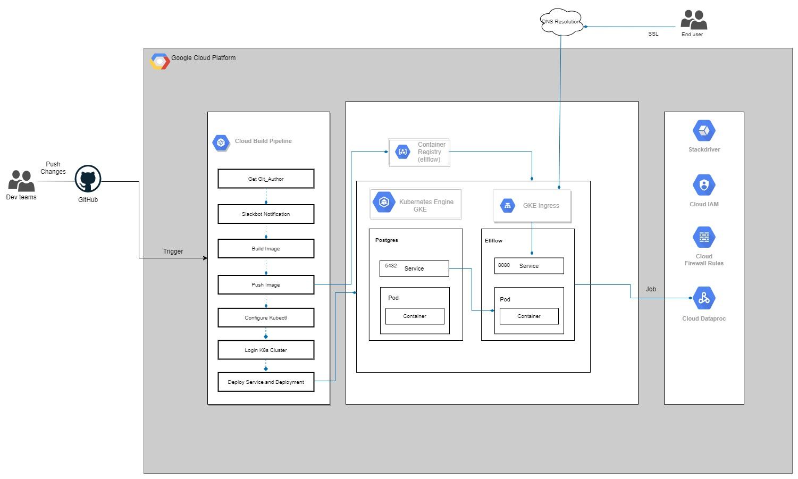

This folder contains scripts(cloudbuild.yaml and Kubernetes yaml configs) that will help you setup the etlflow application on Google Kubernetes Engine. 

The cloudbuild.yaml specifies all the steps that make up your CI/CD pipeline to deploy examples project in GKE.

STEP 1) On your Google Console, go to Cloud Build. In case the API is not enabled for your project, enable it. 

STEP 2) Click on Triggers and set up the trigger. 

STEP 3) You have options available to use your GitHub/Bitbucket repo as the source for your code. Or you can use Google's Cloud Source Repositories. Refer https://cloud.google.com/cloud-build/docs/automating-builds/create-manage-triggers for details.

STEP 4) Once your Source Code is set, Click on Add Trigger to configure the Trigger. 
You can trigger the Cloud Build bases on Events like Push to branch, Push Tags or Pull Requests on your repo. Ensure that the Build Configuration file location is set properly. 

STEP 5) Google CloudBuild also has provisions for using variables and custom substitutions. The sample cloudbuild.yaml makes use of the following variables:

PROJECT_ID -> The GCP project ID. Set by Default\
SHORT_SHA -> The Short SHA for the Git Commit. Set by Default\
_GCS_BUCKET -> Name of GCS bucket where you will store the Jars. Should be of the form gs://<bucket-name>. You can get this value by navigating to the bucket properties on Google Console\
_REGISTRY -> The Docker registry which would host the Docker image. If you are using GCR, it will be of the form gcr.io or asia.gcr.io\
_IMAGE -> The path in Docker registry. For example: dev/etlflow. This would be concatenated with the Registry value\
_CLUSTER -> The name of your Google Kubernetes cluster\
_REGION -> The region where your Cluster resides. For example: asia-south1\

Once the trigger is created, any push to the branch/tag will start the CI/CD pipeline, build and publish the Docker image and deploy the workloads to GKE.